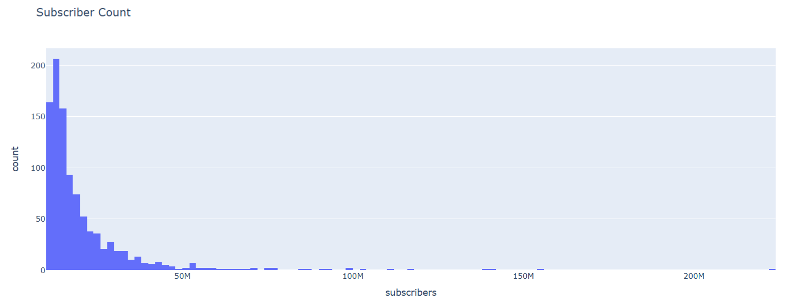
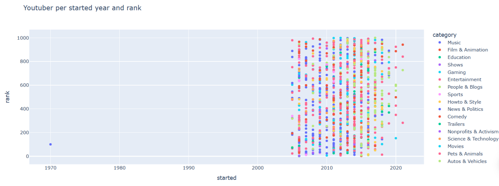

# YouTube Channel Analysis

## Overview
This project explores a dataset of the most subscribed YouTube channels to understand patterns between subscribers, views, rankings, and content categories.

The goal is to apply data analysis and visualization techniques to extract meaningful insights from real-world data.

---

## Objectives
- Analyze the distribution of subscribers across top channels  
- Explore the relationship between channel rank and creation year  
- Identify dominant content categories  
- Understand patterns that influence channel popularity  

---

## Dataset
The dataset used in this project is sourced from Kaggle:

🔗 https://www.kaggle.com/datasets/surajjha101/top-youtube-channels-data

This dataset provides detailed information about the most subscribed YouTube channels, including:

- Channel name  
- Subscribers  
- Total views  
- Number of uploads  
- Category  
- Year started  
- Rank  

> Note: The dataset was cleaned and preprocessed before analysis to ensure consistency and usability.

---

## Tools & Technologies
- Python  
- Pandas  
- Plotly  
- Google Colab  

---

## Analysis & Visualizations

The project includes several visualizations to explore the data:

- **Subscribers Distribution**  
  A histogram showing how subscriber counts are distributed  

- **Category Distribution**  
  A pie chart highlighting which categories dominate  

- **Start Year vs Rank**  
  A scatter plot analyzing the relationship between channel age and ranking  

- **Channel Creation Trends**  
  A box plot showing the distribution of channel starting years  

---

##  Key Insights
- Subscriber distribution is highly skewed, with a small number of channels dominating  
- There is no strong direct relationship between channel age and rank  
- Certain categories attract significantly more subscribers than others  
- Channel success depends on multiple factors rather than a single variable  

---

##  What I Learned
Through this project, I improved my skills in:
- Data cleaning and preprocessing  
- Data visualization using Plotly  
- Interpreting and communicating insights from data  
- Structuring a complete data analysis workflow  

---

## Sample Visualizations
*(Add your screenshots in an `images/` folder and link them here)*

  
  
  

---

##  Future Improvements
- Add more advanced and interactive visualizations  
- Explore additional datasets for deeper analysis  
- Build an interactive dashboard version of the project  

---

## How to Run
1. Open the notebook in Google Colab  
2. Upload the dataset when prompted  
3. Run all cells to reproduce the analysis  

